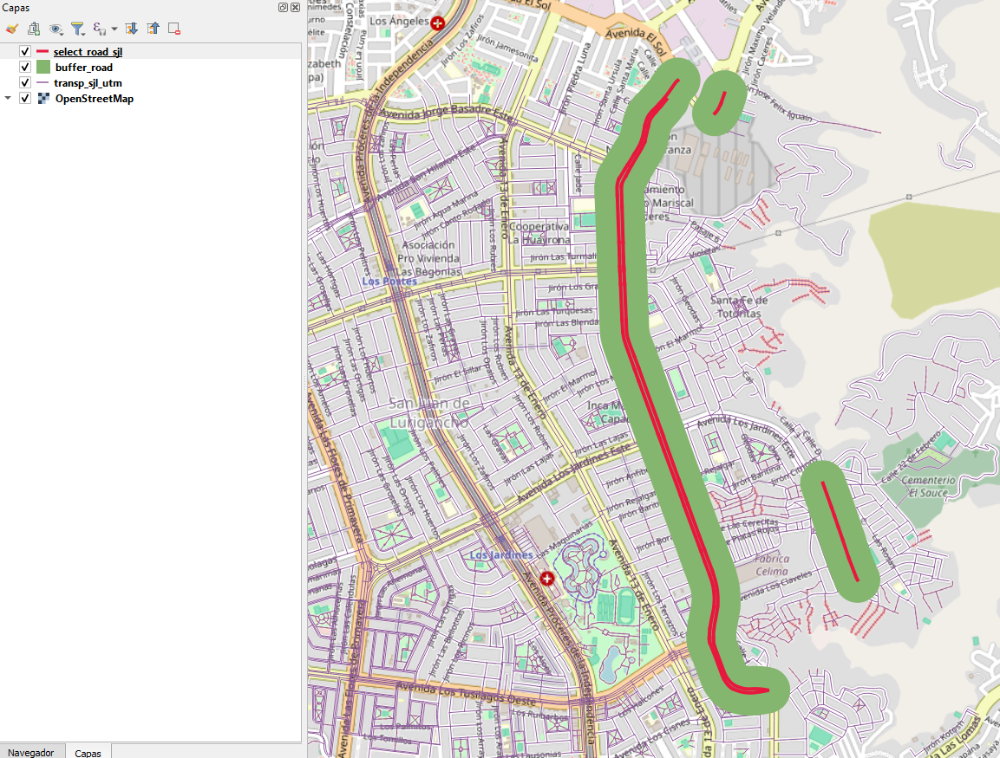

# R_geoparquet

This project provides tools for working with GeoParquet files in R.



## Table of Contents

## Installation

To use this project, you need to install the following R packages:

```r
install.packages("sf")
install.packages("sfarrow")
install.packages("dplyr")
```

## Usage

Here is an example of how to use the tools provided by this project:

```r
library(sf)
library(sfarrow)
library(dplyr)

data <- st_read_parquet('data/example.parquet')

data <- data %>%
    filter(class_type == 'Primary') %>%
    mutate(id = row_number()) %>%
    select(geometry, id)
st_write_parquet(data, 'data/filtered_example.parquet')
```

## Project Structure

- `data/`: Directory for storing GeoParquet files.
- `outputs/`: Directory for storing output files generated by the scripts.

## Contributing

If you would like to contribute to this project, please fork the repository and submit a pull request.

## License

This project is licensed under the MIT License.
